# fcstm-gui 完整操作与验收手册

本文档用于让未阅读源码的操作者从零完成 fcstm-gui 的全部 GUI 验收，并留下可复核证据。步骤中的菜单名、按钮名、状态和产物都是验收合同；控件缺失、文案不符、操作必须绕过 GUI、结果无法复核时，均应记录失败，不能自行跳步。

## 0. 证据边界

- 本文图片由源码态应用在 Linux x86_64、xcb、1280x720 logical px、scale 1 下真实重放生成。
- 图片使用内置 `Noto Sans CJK SC` 10 pt，详情见 [manifest.json](images/workflows/manifest.json)。
- 140 个稳定 acceptance ID 的逐项实操截图、详情、revision/fingerprint 和 SHA 见
  [140 项 GUI Acceptance 截图索引](images/acceptance-140/README.md)，其机器可读合同见
  [acceptance gallery manifest](images/acceptance-140/manifest.json)。
- `images/workflows/` 是按用户旅程整理的分阶段参考图；`images/acceptance-140/` 是
  每个稳定 ID 的独立结果图。两者都来自源码态 Linux xcb，不能冒充其他平台 fresh。
- 这些图片是操作手册参考图，不得替代 fresh onedir/onefile 最终发布证据。
- 最终 READY 仍要求 Linux、Windows、macOS fresh onedir/onefile 的 acceptance JSON、截图、manifest、artifact digest 和 Issue visual attestation 全部通过。
- 图片中的 `<TEMP>`、`<WORKSPACE>` 为正常脱敏；不要为了截图暴露真实用户路径。
- 视觉问题是否阻塞只由功能决定：只要不妨碍使用，且文字/数据可读、控件中心 hit-test 正确、真实点击流程通过、键盘焦点可达、accessible name/tooltip 完整、业务事实和产物正确，原生 style 外框或 focus ring 接触就记录为 non-blocking，不得阻塞交付。任一功能事实失败或未知遮挡仍为 blocking。
- 同步操作没有可观察 running 状态时，步骤图矩阵写 `N/A（同步完成，无可观察 running 态）` 和原因；不得复制结果图冒充 running。

### 0.1 当前 CI 使用方式

触及 `app/`、入口/spec、依赖、`scripts/`、`test/`、schema 或 workflow 的 push/PR
才触发 `.github/workflows/fast-verify.yml`；纯手册、截图和审阅记录提交不会触发
现有 verify/test。Windows/Linux 每个 job 都有十分钟预算，分成两个阶段：Stage 1 在源码态真实执行 `182/182 self-check`、
`140/140 GUI acceptance`（1280x720）和聚焦回归测试，并构建一个轻量 onefile；
Stage 2 使用 fresh runner 下载该 onefile，不 checkout、不安装项目 Python 依赖，
只执行 onefile 的 `182/182 self-check`。它不重复 GUI acceptance，因此文档和小型
GUI 修订不会反复等待完整三平台发布矩阵。

需要发布包或重新取得三平台 fresh 证据时，在 Actions 手动运行
`Full Release Build & Verify`，或推送 `v*` tag。该流程才执行 source/onedir/onefile
和三平台 fresh runner 全矩阵；它的 artifact 是完整发布证据。Fast Verify fresh
artifact 只覆盖 Windows/Linux onefile self-check，不要把它当作完整发布证据。
若只修改手册、截图、审阅记录或 workflow/证据脚本，且
`git diff --quiet b6bb7e2..HEAD -- app main.py main.spec requirements*.txt Makefile`
通过，则沿用历史 Full Release baseline，不重复消耗三平台发布矩阵；一旦核心产品树
变化，必须重新取得对应 fresh artifact。

## 1. 前置条件

### 1.1 普通用户

1. 解压同一平台的完整 onedir ZIP，或取得 onefile 成品。
2. 准备 Java 11 或兼容 JRE，并执行 `java -version`。
3. 不安装项目 Python、requirements、Graphviz 或编译器来帮助 fresh 成品通过。
4. runner 预装 Python 仅可在成品退出后运行仓库随 evidence 携带的纯标准库
   manifest/SHA 校验器；不得 import 项目、安装包或参与成品功能执行。
5. 准备一个可写的空目录，例如 `acceptance-output`。
6. 启动 `fcstm-gui`，确认首屏有“导入状态机”和“新建状态机”。

### 1.2 源码态文档截图维护者

在仓库根目录执行：

```bash
QT_QPA_PLATFORM=xcb QT_SCALE_FACTOR=1 \
  xvfb-run -a .venv/bin/python scripts/capture_workflow_docs.py \
  --viewport 1280x720 --scale 1
```

脚本会真实执行打开、诊断、Smetana 图形、普通仿真、动态验证、五模板生成、统一导出和任务历史，并重建 `docs/images/workflows/`。运行后必须逐张打开图片，复算 manifest SHA，再更新第 8 节审阅记录。

若已有一次完整 acceptance report，可把 140 项截图固化为逐项图廊：

```bash
venv/bin/python -m scripts.build_acceptance_gallery \
  --report /path/to/acceptance-output/report.json \
  --artifacts /path/to/acceptance-output/artifacts \
  --source-commit "$(git rev-parse HEAD)" \
  --output docs/images/acceptance-140
```

命令拒绝非 `140/140 passed`、顺序不等于冻结 `ACCEPTANCE_NAMES` 或缺失 item PNG 的报告。

### 1.3 本手册固定模型

核心流程使用以下 `acceptance.fcstm`：

```fcstm
def int count = 0;
state Root {
    state Idle;
    state Running;
    [*] -> Idle;
    Idle -> Running :: Start effect { count = count + 1; }
    Running -> [*] :: Stop;
}
```

验收事实：初始状态为 `Root.Idle`；输入 `Start` 后进入 `Root.Running` 且 `count=1`；输入 `Stop` 后结束。

### 1.4 可复现 fixture 包

在 `acceptance-output` 旁新建 `acceptance-work`。所有文本文件均以 UTF-8 保存；除明确要求 CRLF 的文件外使用平台默认换行。源码仓库操作者可直接使用下列已入库资源，成品操作者则按本节文本创建同名文件。不得临时改变 expected 来迎合 actual。

| 文件/目录 | 创建内容或仓库来源 | 用途 |
| --- | --- | --- |
| `acceptance.fcstm` | 第 1.3 节完整文本 | 主流程 |
| `other.fcstm` | `state Other;` | dirty/open 替换 |
| `warning.fcstm` | `state Root { state A; [*] -> A; }` | inspect warning `W_DEADLOCK_LEAF` |
| `assembly.fcstm` | `state Root { state A; [*] -> Missing; }` | assembly/model 缺失目标 |
| `recent-01.fcstm` ... `recent-12.fcstm` | 分别复制 `state Recent01;` ... `state Recent12;` | 最近文件上限与排序 |
| `leaf.fcstm` | `state Leaf;` | imported 来源叶文件 |
| `child.fcstm` | `state Child { import "./leaf.fcstm" as Nested; [*] -> Nested; }` | imported 中间文件 |
| `root-import.fcstm` | `state Root { import "./child.fcstm" as Imported; [*] -> Imported; }` | imported 根文件 |
| `rename-crlf.fcstm` | 下方代码块，编辑器明确选择 CRLF | Unicode/CRLF 重命名 |
| `dynamic-model.fcstm`、`dynamic-pass.json`、`dynamic-mismatch.json` | 下方动态验证块 | user/mutation/recover |
| `custom-template/config.yaml` | 仅一行 `{}` | 自定义模板配置 |
| `custom-template/hello.txt.j2` | `root={{ model.root_state.name }}` | 自定义模板非空产物 |

`rename-crlf.fcstm` 内容：

```fcstm
// 😀 中文：state Parent Leaf 仅为注释，必须逐字保留
state Root {
    // state Parent 也仅为注释
    state Parent {
        state Leaf;
        state Other;
        [*] -> Leaf;
        Leaf -> Other;
    }
    [*] -> Parent;
}
```

动态验证文件以仓库资源
`app/resources/self_check/dynamic_validation/design_validation_failure_multilevel_transition.{fcstm,json}`
为权威来源。成品盲测时复制该 `.fcstm` 为 `dynamic-model.fcstm`，复制 JSON 为
`dynamic-pass.json`，仅把 JSON 的 `model_file` 改为 `dynamic-model.fcstm`。再复制为
`dynamic-mismatch.json`，把 `case_id` 改成 `manual_mutation`，并且只把最后一步
`expected.state` 从 `Root.A` 改为 `Root.Mutated`。两个 JSON、模型必须放在同一目录；
除这两个字段外逐字保持。这样 pass、mutation、restore 使用同一生产 loader 和 runtime。

`dynamic-model.fcstm` 完整内容：

```fcstm
def int counter = 0;
def int flag = 0;
state Root {
    state A { during { counter = counter + 1; } }
    state B {
        enter { flag = 1; }
        state B1 { during { counter = counter + 10; } }
        [*] -> B1 : if [flag == 2];
    }
    [*] -> A;
    A -> B : if [counter >= 3] effect { flag = 1; };
}
```

`dynamic-pass.json` 完整内容（文件名字段已经改好）：

```json
{
  "schema": "fcstm-gui.dynamic-validation-scenario",
  "version": 1,
  "case_id": "design_validation_failure_multilevel_transition",
  "upstream_case_id": "design_validation_failure_multilevel_transition",
  "upstream_commit": "f142a656df43e0b80ed6b7ac63b0696345325646",
  "model_file": "dynamic-model.fcstm",
  "initial": {"state": null, "variables": {}},
  "steps": [
    {"events": [], "commands": [], "expected": {"state": "Root.A", "variables": {"counter": 1, "flag": 0}, "ended": false}},
    {"events": [], "commands": [], "expected": {"state": "Root.A", "variables": {"counter": 2, "flag": 0}, "ended": false}},
    {"events": [], "commands": [], "expected": {"state": "Root.A", "variables": {"counter": 3, "flag": 0}, "ended": false}},
    {"events": [], "commands": [], "expected": {"state": "Root.A", "variables": {"counter": 4, "flag": 0}, "ended": false}}
  ]
}
```

每轮开始前记录这些文件的 SHA-256。若操作者无法取得仓库资源，则必须从本手册附带的
完整代码块创建；仓库资源用于复算权威 SHA。任何代码块、资源或 release fixture 缺失都属于文档/发布失败，不能跳过对应 family。

## 2. 核心流程

### 2.1 打开文档

**前置条件**：应用刚启动，尚未打开文档。

1. 确认首屏仅显示真实空状态，不显示虚假的模型、诊断或任务成功记录。
2. 按 `Ctrl+O`；macOS 按 `Cmd+O`。
3. 在文件选择器中输入 `acceptance.fcstm` 的路径并确认。
4. 等待文档状态区显示文件名、`revision 0`、已保存和校验状态。
5. 确认模型树出现 `Root / Idle / Running`，属性检查器显示根状态来源。

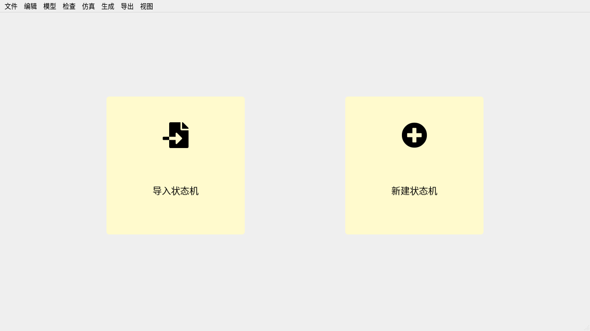

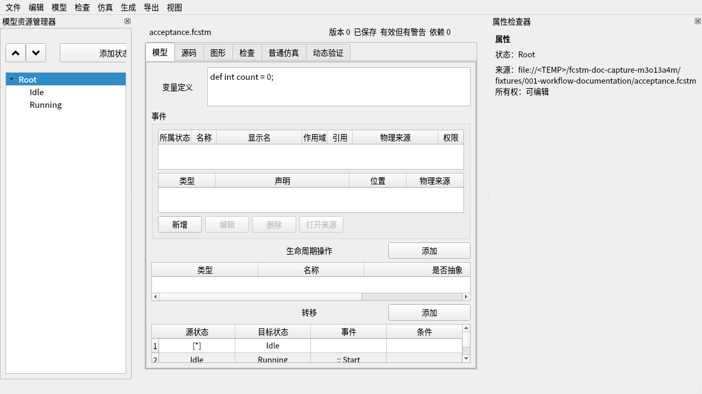

**预期状态**：当前 session 指向所选文件；源码文本逐字等于文件；有效 snapshot 可用；最近文件菜单增加该文件。

**失败恢复**：文件不存在、编码无法确定或依赖加载失败时，旧 session、dirty、选择、undo 栈和当前工作区必须保持。不要通过重新启动掩盖失败。

失败保持使用确定步骤：先成功打开 `other.fcstm` 让它进入最近文件，返回 `acceptance.fcstm` 并制造一个未保存空格；在操作系统中删除 `other.fcstm`，再从“文件 -> 最近文件”选择它。记录失败前后的 session URI、source revision、dirty、selection、undo 可用性和 current workspace，必须逐项相同；该项为 `document.failed-load-preserves-session`。重新创建 `other.fcstm` 后从最近文件重开为 `document.recent-reopen`。加载运行行出现时通过任务中心动作列请求取消并核对同样事实，为 `document.cancel-load`；如果任务过快未出现 running 行，该次不算取消通过。

**自动化 item**：`document.open`、`keyboard.workspace`、`tasks.registry.load`。

### 2.2 结构化诊断、定位与恢复

**前置条件**：已打开固定模型。

1. 切换“源码”页，把内容替换为 `state Broken { state ; }`。
2. 等待防抖校验结束，确认状态为“语法无效”，图形、仿真、生成和导出被禁用。
3. 切换“检查”页。
4. 在诊断表核对来源 `syntax`、消息、真实位置和“定位”按钮。
5. 选中首行并按“定位”；焦点必须回到源码错误范围，且范围非空。
6. 恢复第 1.3 节源码，等待完整重验。
7. 返回检查页，确认旧诊断不再作为当前 revision 结论。

三来源必须分别执行，不能用 syntax 一项代替：

| 稳定 ID | 确定输入 | 必须观察 |
| --- | --- | --- |
| `diagnostics.syntax` | 源码替换为 `state Broken { state ; }` | source=`syntax`，非空 span，定位选择错误 token |
| `diagnostics.assembly` | GUI 打开 `assembly.fcstm` | source=`model/assembly`，消息含 `Missing`，旧有效 snapshot 不冒充当前 |
| `diagnostics.inspect` | GUI 打开 `warning.fcstm` 后按 F5 | warning、code=`W_DEADLOCK_LEAF`、span 和 provenance 均可见 |
| `diagnostics.conflict-warning` | 在 `warning.fcstm` 增加第二个同名 `state A;`，恢复后再 F5 | 冲突阻止提交；恢复后 warning 可筛选和搜索 |
| `diagnostics.suggested-fix` | 源码固定为 `state Root { state A; [*] -> A; }`，按 F5，选择 code=`W_DEADLOCK_LEAF` | “建议修复”必须可见；确认预览后源码精确增加 `A -> [*];`，revision 增加并重新验证通过 |

每项依次操作严重度筛选、文本搜索、详情、定位；保存 screenshot、当前 revision、URI、code 和 suggested-fix 结构。恢复固定模型后再进入下一项。

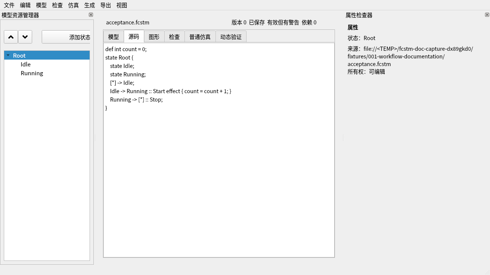

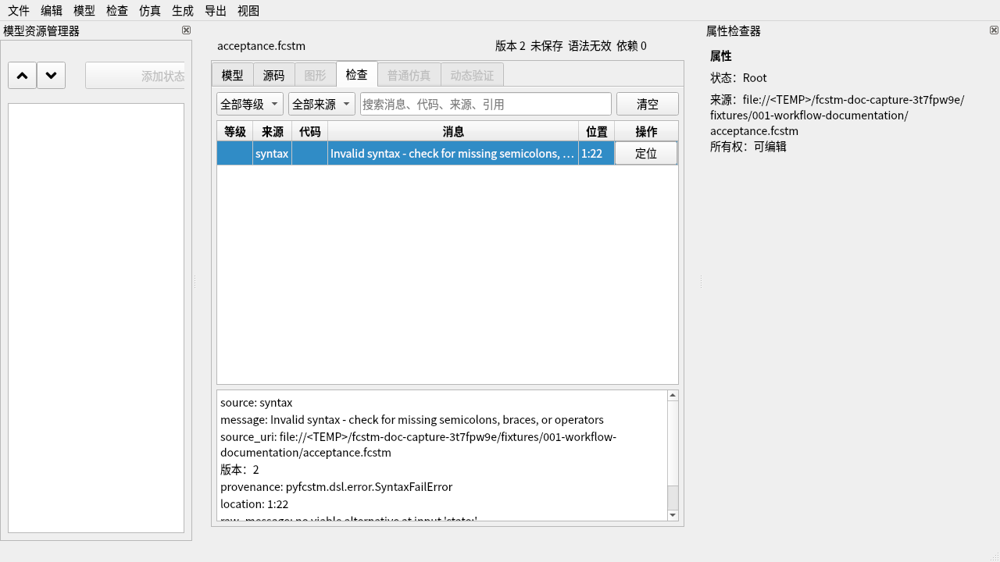

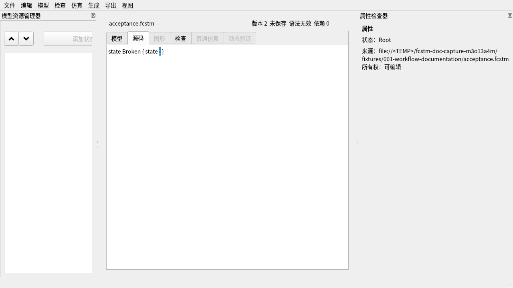

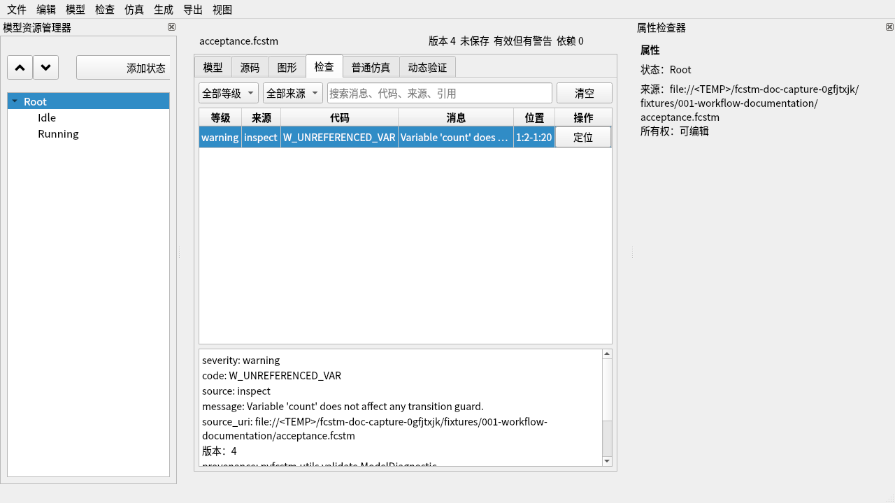

**预期状态**：诊断绑定当前 session/revision/fingerprint；恢复后消费者重新可用；旧有效模型不会冒充无效源码的当前模型。

**产物/schema**：inspect JSON 使用版本化对象；每项保留 severity、source kind、code、message、span、URI 和 provenance。

**自动化 item**：`diagnostics.syntax`、`diagnostics.assembly`、`diagnostics.inspect`、`diagnostics.filter-search`、`diagnostics.conflict-warning`、`diagnostics.locate`、`diagnostics.suggested-fix`、`formula.stale`。

### 2.3 真实状态图

**前置条件**：当前 revision 有有效 snapshot，Java 可用。

1. 按 `Ctrl+3` 或 `Cmd+3` 打开“图形”页。
2. 按“刷新”。任务运行时状态应立即变为渲染中，但任务 dock 不应因普通成功任务强制展开。
3. 等待状态变为“就绪”。
4. 在画布中确认 `Root`、`Idle`、`Running`、迁移标签 `Idle.Start` / `Running.Stop` 与变量表真实可见；“适应”缩小时若笔画发虚，按“100%”并滚动查看完整标签。
5. 依次操作“适应”“100%”“重置”，滚轮缩放并拖动画布。
6. 在左侧模型树单击 `Idle`，确认图形状态行显示 `选择 Root.Idle`；切回图形页后选择仍保留。这是 `graph.selection`。
7. 确认画面中不存在 `Cannot find Graphviz`、`dot executable` 或 renderer error。

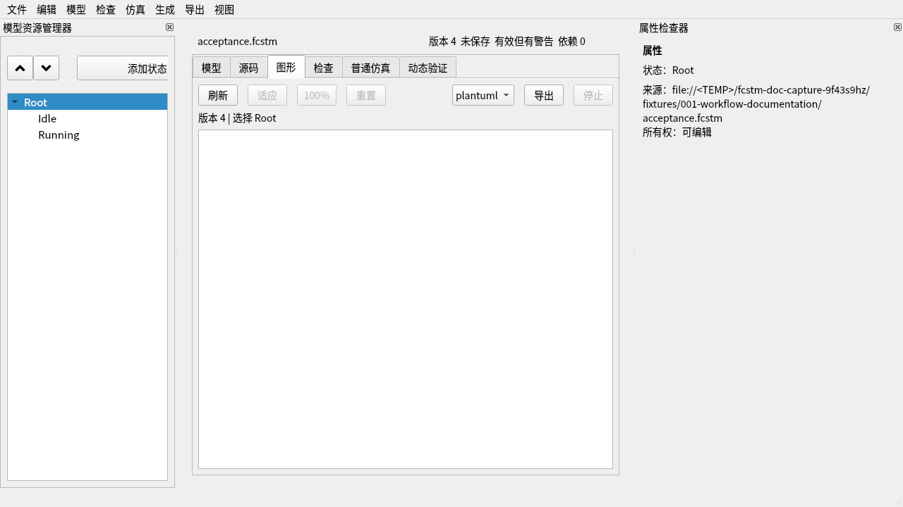

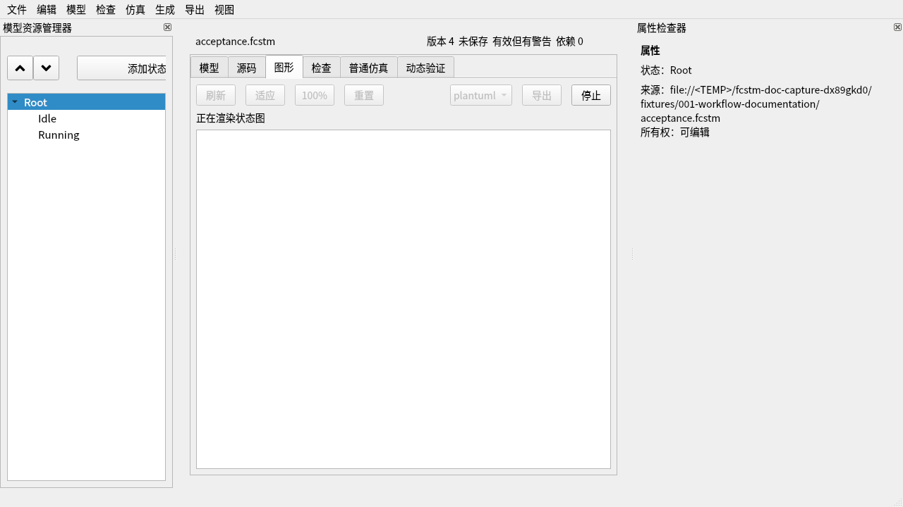

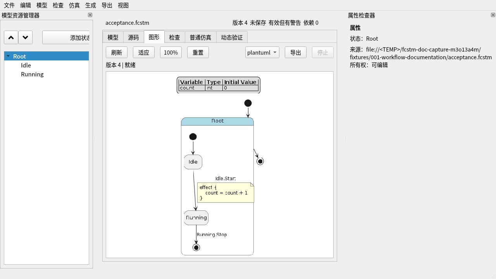

**预期状态**：engine 为 `smetana`；renderer exit code 为 0；SVG 语义与同一 PlantUML source SHA 绑定；错误图不得覆盖上一张有效图。

**图形导出**：在图形页“导出”按钮左侧的类型下拉框依次选择下表类型，再按“导出”；目标分别为
`graph.puml`、`graph.png`、`graph.svg`、`graph.pdf`。每次从当前 ready 图重新执行，不复用统一导出的文件。

| ID | GUI 选择 | 文件 oracle |
| --- | --- | --- |
| `graph.export.plantuml` | 导出 -> PlantUML | UTF-8；含 `@startuml`、Smetana pragma、Root/Idle/Running；SHA 与当前图 source SHA 一致 |
| `graph.export.png` | 导出 -> PNG | 前 8 bytes 为 PNG magic；宽高大于 0；无 renderer error 文本 |
| `graph.export.svg` | 导出 -> SVG | 可解析 XML；根元素为 `svg`；文本含 Root/Idle/Running |
| `graph.export.pdf` | 导出 -> PDF | 前 5 bytes 为 `%PDF-`；文件非空；任务产物绑定当前 revision/source SHA |

为每项保存目标 SHA-256、size、magic/解析结果和独立截图。图形页没有覆盖开关；先放置内容为 `OLD` 的同名文件后再次导出，必须失败且旧 SHA 不变。需要替换时由用户另选新文件名，不得静默覆盖。

**失败恢复**：渲染失败时显示结构化原因和“重试当前版本”，保留上一张有效图并标明旧 revision。

**自动化 item**：`graph.refresh`、`graph.zoom`、`graph.drag`、`graph.fit`、`graph.reset`、`graph.selection`、`graph.export.plantuml`、`graph.export.png`、`graph.export.svg`、`graph.export.pdf`、`cancel.graph`、`stale.graph`。

### 2.4 普通仿真

**前置条件**：当前 revision 有有效 snapshot。

1. 按 `Ctrl+5` 或 `Cmd+5` 打开“普通仿真”。
2. 初始状态留空，初始变量保持 `{}`，按“初始化”。
3. 核对状态为“就绪”、当前状态为 `Root.Idle`、cycle 为 1、`count=0`。
4. 在“输入事件”填写 `Start`，按“单步”。
5. 核对 `Root.Running`、cycle 2、`count=1`，以及已消费/未消费事件和结果列。
6. 把“连续 cycle 上限”设为 `10000`，按“连续运行”；“暂停”启用后立即按下。
7. 等待 cycle 边界显示“已暂停”，再按“继续”；确认 runtime、cycle 和 transcript 连续。
8. 继续时把上限改为 `2`；结果 cycle 必须恰好再增加 2，runtime identity 和旧 transcript 保持。
9. 再次把上限设为 `10000` 并连续运行，“停止”启用后立即按下；状态必须为“已取消，已保留完成的 cycle”，不得显示 success/failed。
10. 记录取消后的 transcript 行数，按“重置”；确认同一文档重新回到 `Root.Idle`、cycle 1、`count=0`，旧取消记录仍可在任务历史查看。

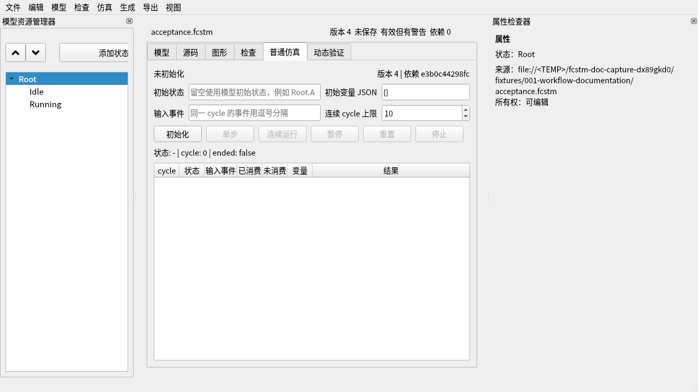

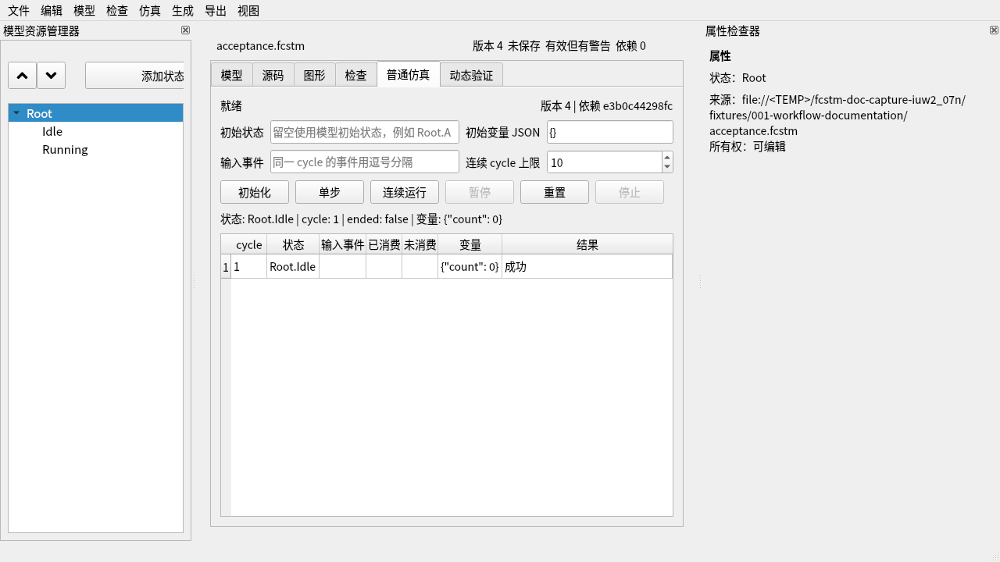

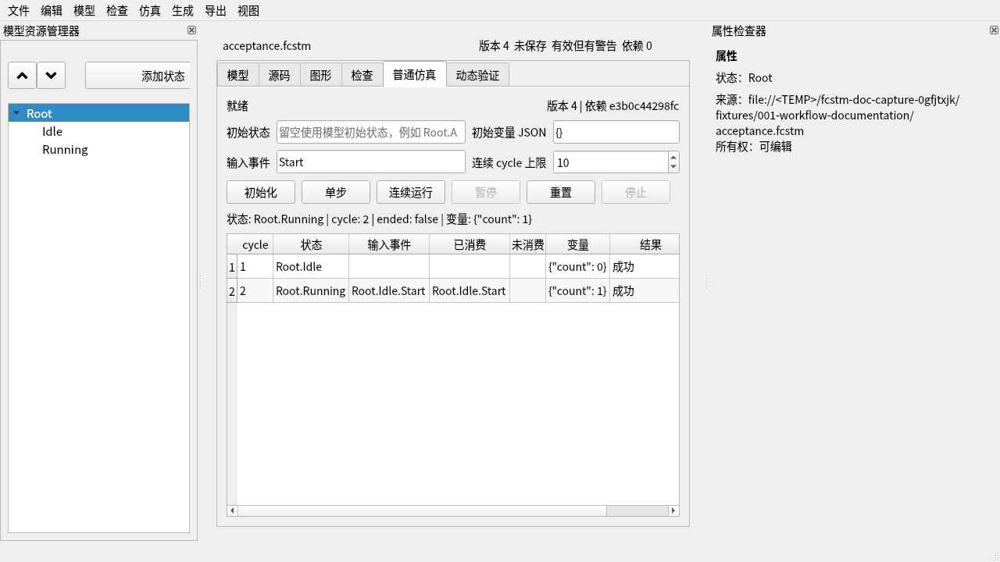


暂停图必须同时显示“已暂停”和“继续运行”，且 transcript 保留暂停前已经完成的 cycle。

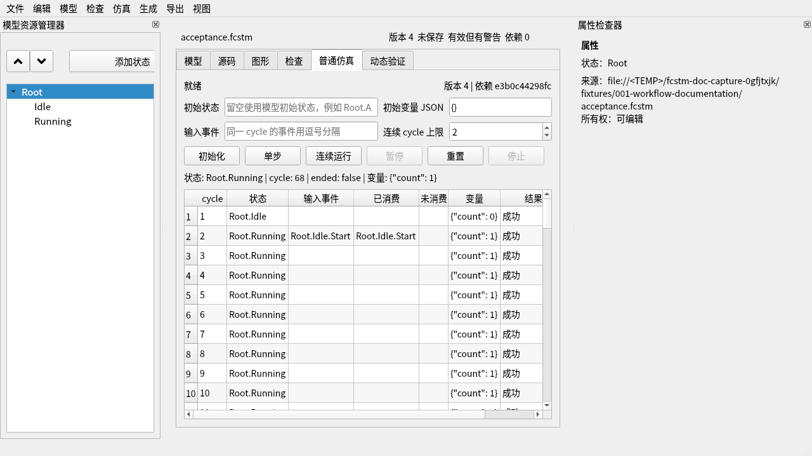

继续图必须在原 transcript 后追加 cycle；不得重新初始化、清空 runtime 或丢弃暂停段结果。

**预期状态**：暂停 segment 以 success/outcome=`paused` 结束，继续创建新 segment 但复用同一 runtime；停止为 cancelled；修改源码后下一个 cycle 边界变为 stale 并保留已完成 transcript。

**自动化 item**：`simulation.initialize`、`simulation.step`、`simulation.run`、`simulation.pause`、`simulation.continue`、`simulation.reset`、`simulation.stop`、`cancel.simulation`、`stale.simulation`、`keyboard.simulation`。

### 2.5 动态验证

**前置条件**：当前 revision 有有效 snapshot。动态验证与普通仿真必须是独立 runtime。

1. 按 `Ctrl+6` 或 `Cmd+6` 打开“动态验证”。
2. 先读页面固定声明：“动态验证是场景 expected/actual 对比，不是形式化验证、模型检测或证明”。
3. 按“全部验收”，等待四个内置用例完成。
4. 确认总状态“通过”（结构化 JSON status=`passed`），表中逐 step 显示 expected、actual、diff、rollback 和结果。
5. 选择单个内置用例重跑；结果必须与 suite 中同一用例一致。
6. 按“选择场景”选择 `dynamic-mismatch.json`，按“用户场景”；确认界面为“不匹配”、JSON status=`mismatch`，diff 精确指出最后一步 expected `Root.Mutated` 与 actual `Root.A`。
7. 不关闭应用，改选 `dynamic-pass.json` 再按“用户场景”；确认恢复为“通过”，scenario SHA 恢复为 pass 文件 SHA，前一 mismatch 仍保留在任务历史。
8. 导出报告并核对 scenario SHA、model fingerprint、source revision 和 fixture provenance。

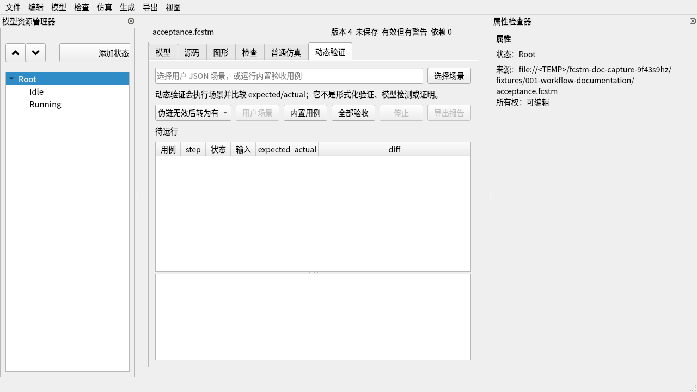

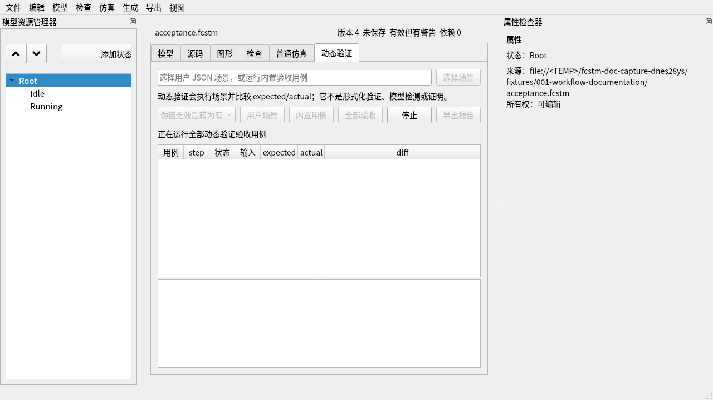

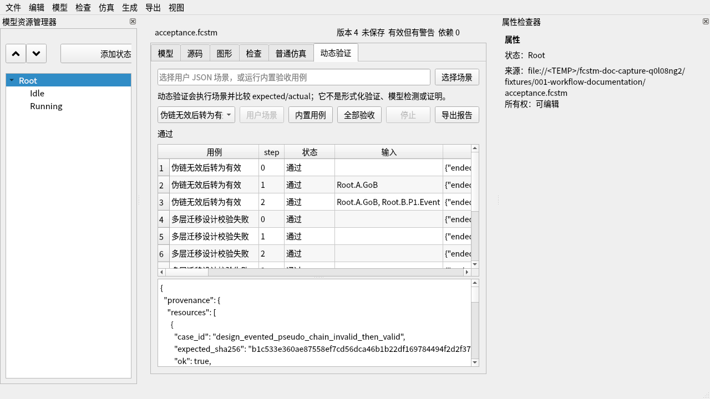

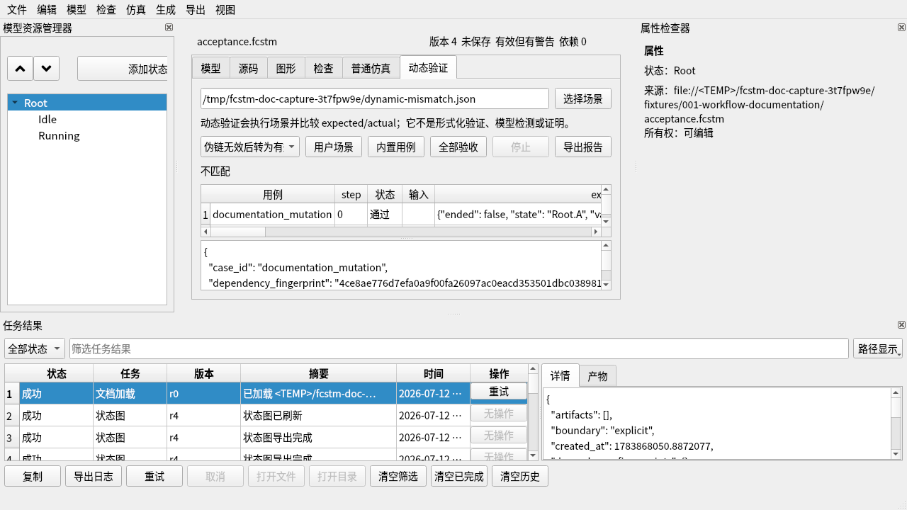

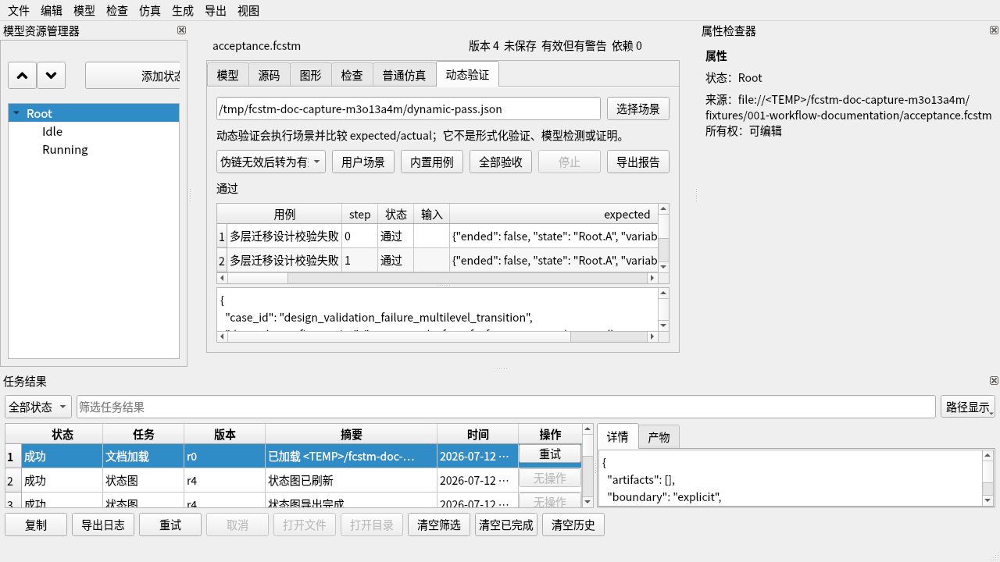

**失败恢复**：场景 schema 错误只影响该场景；取消在 step 边界生效并保留已完成 step；普通仿真状态不得被改变。

四个内置用例必须分别选择“内置用例”运行，不能只按“全部验收”：

| 稳定 ID | 独立 oracle |
| --- | --- |
| `dynamic.case.design_evented_pseudo_chain_invalid_then_valid` | report=`passed`，3 steps；最终 state=`Root.B.B1`、counter=`112`、diffs=[] |
| `dynamic.case.design_validation_failure_multilevel_transition` | report=`passed`，4 steps；最终仍为 `Root.A`、counter=`4`、flag=`0`、diffs=[] |
| `dynamic.case.expression_failure_transition_guard_raises_expression_error` | report=`passed`，2 steps；step 1=`expected_exception_passed`，异常=`SimulationRuntimeExpressionError`，cause=`ZeroDivisionError: division by zero`，rollback=true |
| `dynamic.case.pseudo_self_loop_step_limit_raises_dfs_error` | report=`passed`，2 steps；step 1=`expected_exception_passed`，异常=`SimulationRuntimeDfsError` 且消息含 `step safety limit`，rollback=true |

每行导出独立 JSON，核对 `case_id`、step 数、expected/actual/diffs、scenario SHA、model fingerprint 和 source revision。

**自动化 item**：四个 `dynamic.case.<完整 case-id>` 独立项，以及 `dynamic.user`、`dynamic.mutation`、`dynamic.recover`、`dynamic.export`、`cancel.dynamic`、`stale.dynamic`、`terminology.dynamic-not-formal`；完整 ID 见第 6 节，不允许 suite 一个结果代替四项。

### 2.6 五个内置模板生成

**前置条件**：当前 revision 有有效 snapshot，目标目录不存在或为空。

1. 打开“生成 -> 代码生成”。
2. 模板来源选择“内置模板”。
3. 依次选择 `python`、`c`、`c_poll`、`cpp`、`cpp_poll`。
4. 每次选择独立输出目录；默认不勾选替换已有目录。
5. 按“开始生成”，核对文件清单、size、SHA-256、入口文件、revision 和 fingerprint。
6. 使用“打开目录”确认产物真实存在。
7. 模板来源改为“自定义模板”，选择第 1.4 节 `custom-template`，输出到新的 `generated-custom`；结果必须含非空 `hello.txt` 且内容为 `root=Root`。
8. 删除 `custom-template/config.yaml` 后输出到新的 `generated-custom-invalid`；必须失败且目标目录不存在。恢复配置后重跑必须成功。


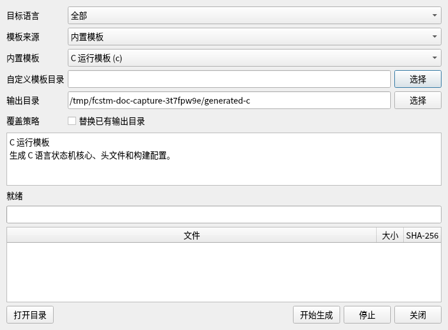

| 模板 | 真实结果截图 |
| --- | --- |
| Python | [文件清单](images/workflows/06-five-template-generation/03-result-python.png) |
| C | [文件清单](images/workflows/06-five-template-generation/03-result-c.png) |
| C poll | [文件清单](images/workflows/06-five-template-generation/03-result-c_poll.png) |
| C++ | [文件清单](images/workflows/06-five-template-generation/03-result-cpp.png) |
| C++ poll | [文件清单](images/workflows/06-five-template-generation/03-result-cpp_poll.png) |

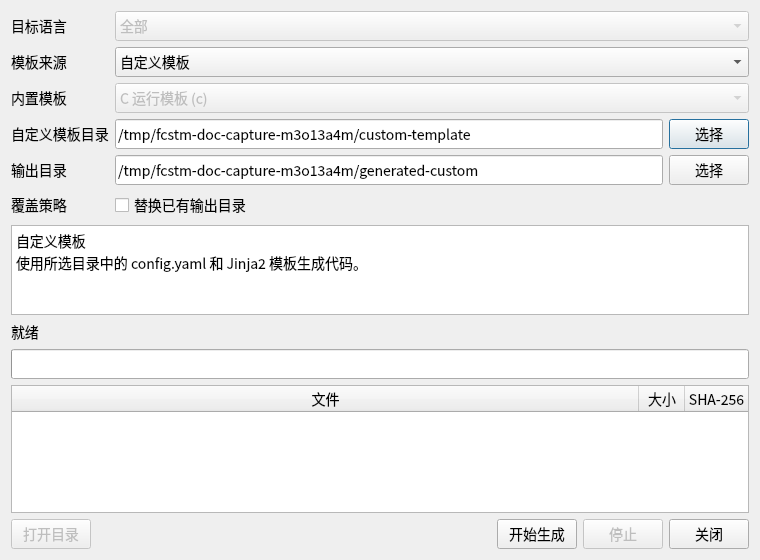

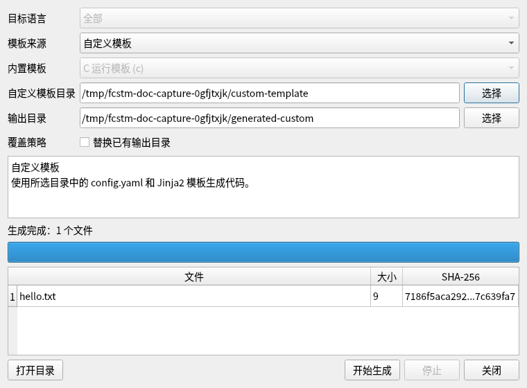

**声明边界**：GUI 只证明真实生成和 manifest，不声称本机已编译。Python 运行及四套 C/C++ 配置、编译、链接、运行证据只来自 Stage 1 原生 build runner。

**失败恢复**：覆盖已有目录必须二次确认；取消、模板错误和 stale 均清理 staging，旧目录 manifest 逐字节不变。

**自动化 item**：`generation.python`、`generation.c`、`generation.c-poll`、`generation.cpp`、`generation.cpp-poll`、`generation.custom`、`generation.overwrite`、`cancel.generation`、`stale.generation`。

### 2.7 统一导出

**前置条件**：当前 revision 有有效 snapshot；动态报告格式另要求已有动态验证结果。

1. 打开“导出 -> 统一导出”。
2. 每次只选择一种格式，填写目标文件，默认不覆盖。
3. 按下表依次执行；目标名固定，不接受自动改名后未核对。
4. 每项完成后核对文件 size、SHA、schema 或 magic，并用“打开”或“目录”确认真实产物。
5. 创建同名旧文件且不勾选覆盖，再次导出；必须失败且旧文件内容不变。

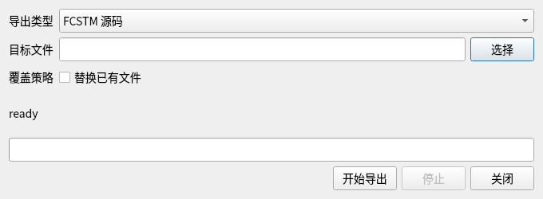

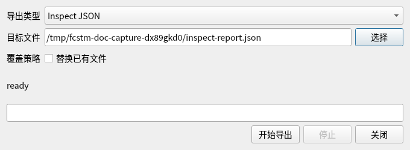

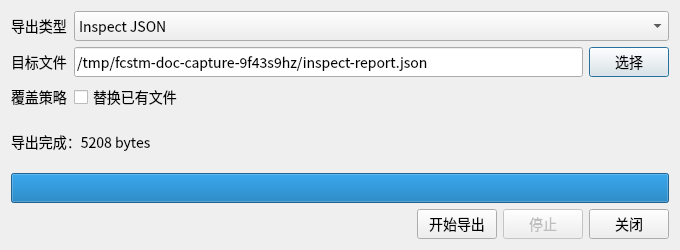

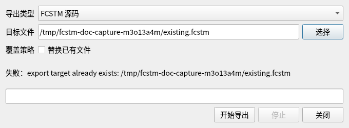

**格式 oracle**：DOCX/XLSX 检查 ZIP magic 与关键内部文件；PNG/PDF 检查 magic；SVG 解析 XML；JSON 解析 schema/version；PlantUML 检查 `@startuml` 和 Smetana pragma。

| 稳定 ID | 对话框“导出类型” | 固定目标 | 必须核对 |
| --- | --- | --- | --- |
| `export.dsl` | FCSTM 源码 | `model.fcstm` | UTF-8，重新打开事实等价，文本与当前 source 一致 |
| `export.word` | Word 文档 | `model.docx` | ZIP magic `PK`，含 `[Content_Types].xml` 与 `word/document.xml` |
| `export.excel` | Excel 工作簿 | `model.xlsx` | ZIP magic `PK`，含 `[Content_Types].xml` 与 `xl/workbook.xml` |
| `export.plantuml` | PlantUML 源码 | `model.puml` | `@startuml`、Smetana pragma、Root/Idle/Running |
| `export.png` | PNG 状态图 | `model.png` | PNG magic、非零宽高、无诊断图 |
| `export.svg` | SVG 状态图 | `model.svg` | XML 可解析、`svg` 根、节点文本存在 |
| `export.pdf` | PDF 状态图 | `model.pdf` | `%PDF-` magic、非空 |
| `export.inspect-json` | Inspect JSON | `inspect.json` | JSON 可解析，schema/version/revision/fingerprint/diagnostics 存在 |
| `export.dynamic-json` | 动态验证 JSON | `dynamic.json` | 先完成第 2.5 节；JSON 可解析，scenario SHA/model fingerprint/source revision/expected/actual 存在 |

每项在任务中心形成独立 `export.<kind>` 记录和 artifact；记录 size、SHA-256、magic/schema 检查结果。随后用内容 `OLD` 的同名目标分别验证未勾选覆盖失败和勾选覆盖二次确认，失败时旧 SHA 必须不变。

**自动化 item**：`export.dsl`、`export.word`、`export.excel`、`export.plantuml`、`export.png`、`export.svg`、`export.pdf`、`export.inspect-json`、`export.dynamic-json`、`export.overwrite-preserves-target`、`cancel.export`、`stale.export`。

### 2.8 任务结果、隐私和失败恢复

**前置条件**：已完成前述显式任务。确定制造失败任务的方法：在统一导出中把目标设为已存在的 `inspect.json`、不勾选“替换已有文件”，按“开始导出”；保留该 failed 记录。

1. 确认普通成功任务完成后 dock 仍收起，底栏只显示紧凑状态。
2. 按 `Ctrl+Shift+J` 打开任务结果。
3. 使用状态筛选和搜索，选择一行查看结构化详情和产物。
4. 按“复制”和“导出日志”，确认默认只包含 `<WORKSPACE>/<TEMP>/<HOME>` 脱敏路径。
5. 仅在明确需要时通过“路径显示 -> 显示完整路径” opt-in；完成后关闭。
6. 对失败项执行“重试”，对运行项执行“取消”，对产物执行“打开文件/目录”。
7. 状态筛选设为“成功”，按“清空筛选”并确认：只删除当前筛选出来的终态记录，其他状态和 running 不受影响；这是 `tasks.clear-filtered`。
8. 重新制造 success、failed、cancelled 三条记录，按“清空已完成”并确认：只删除 success，failed/cancelled/running 保留；这是 `tasks.clear-completed`。
9. 按“清空历史”并确认：只清除其他可持久化终态历史，运行中任务不得被删除；这是 `tasks.clear-all`。取消确认时计数必须不变。

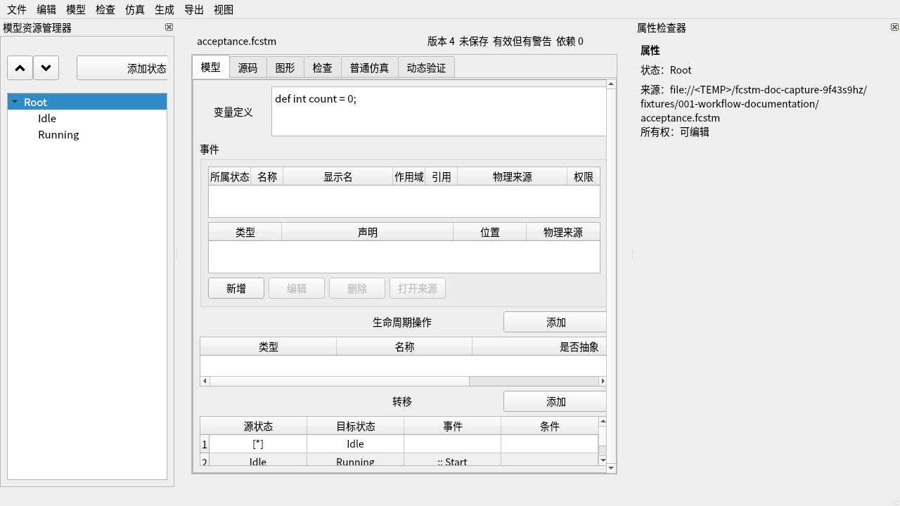

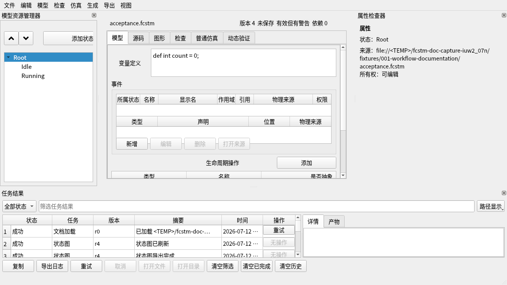

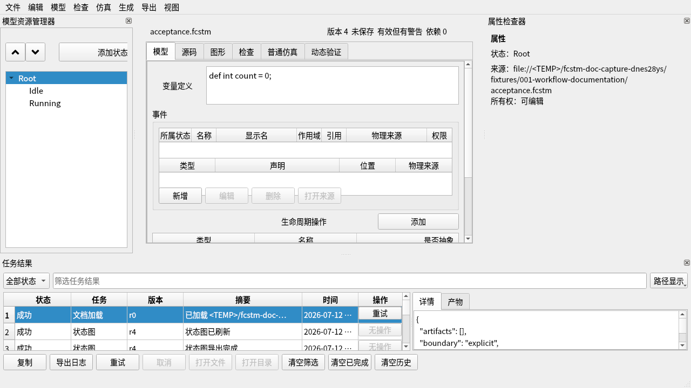

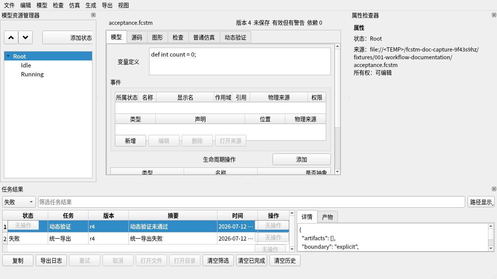

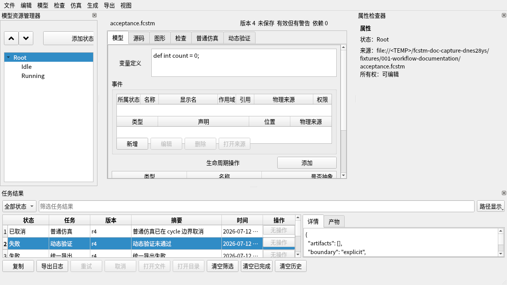

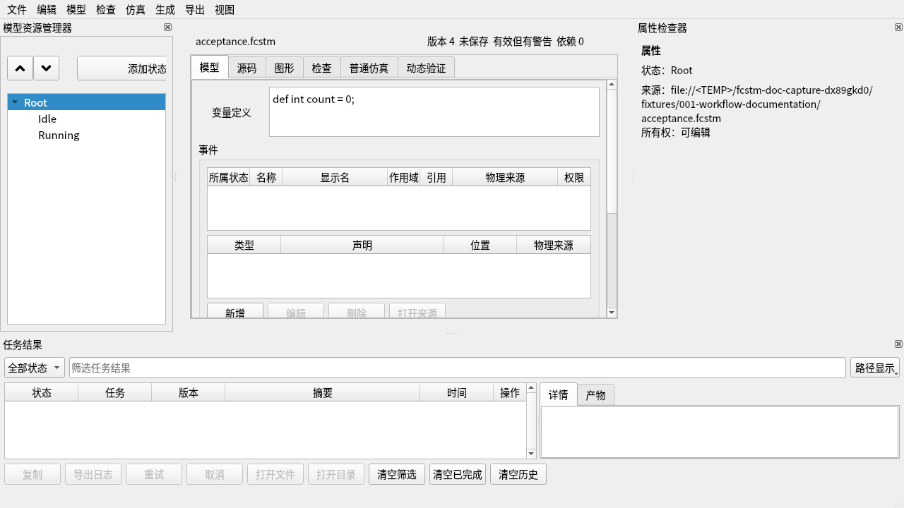

**预期状态**：success 不自动展开；failed/stale 或 `requires_user_action=true` 可展开但不抢焦点；连续失败累计 badge；用户筛选与选择保持。

**自动化 item**：`tasks.filter`、`tasks.copy`、`tasks.export`、`tasks.retry`、`tasks.cancel`、`tasks.artifact`、`tasks.clear-filtered`、`tasks.clear-completed`、`tasks.clear-all`、`tasks.redaction`，以及第 6 节展开的 7 个 registry 和 2 个 transient ID。

任务注册还要逐类核对：文档加载、F5 检查、图形、普通仿真、动态验证、代码生成、统一导出分别产生一个持久历史项，对应 `tasks.registry.load/inspect/graph/simulation/dynamic/generation/export`；源码防抖校验和公式防抖校验只显示瞬时反馈，不得写入历史，对应 `tasks.transient.document-validation/formula-validation`。记录操作前后历史 kind/行数，不能只看 dock 是否打开。

路径边界：用户主动选择的场景文件、自定义模板目录和输出目标会在对应输入框显示完整路径，这是本次选择的直接反馈；任务历史、复制、持久化和日志导出仍默认使用 `<WORKSPACE>/<TEMP>/<HOME>` 脱敏值。

## 3. 模型编辑与公式验收

以下每一行都必须通过真实表单完成一次 add/edit/delete，并保存后关闭、重新打开文件核对事实。不要直接改 Python model。

先复制 `acceptance.fcstm` 为 `crud.fcstm` 并用 GUI 打开。每个 ID 从该原始副本重新开始，避免前一项引用影响删除。源码旅程固定为：在“源码”页末尾输入一个空格 -> `Ctrl/Cmd+Z` -> `Ctrl/Cmd+Shift+Z` -> `Ctrl/Cmd+S` -> 关闭应用 -> 从最近文件重开；分别记录 source revision、dirty、磁盘 SHA 和重开后的文本。这一旅程对应 `source.edit`、`source.undo`、`source.redo`、`source.save`、`source.fresh-reload`。

| 对象 | 新增步骤 | 编辑步骤 | 删除步骤 | 必须核对 |
| --- | --- | --- | --- | --- |
| 状态 | 模型页选择父状态 -> 模型/新建状态 -> 输入唯一名称 -> 提交 | 选择状态 -> 编辑名称 -> 预览 TextEdit -> 提交 | 选择无冲突状态 -> 删除 -> 确认 | 注释、空白、子状态和迁移未被整段重写 |
| 变量 | 模型页变量区 -> 新增定义 | 修改名称、类型或初值 | 删除未引用变量 | NUMERIC 初值走生产公式校验 |
| 事件 | 选择 owner -> 事件/新增 | 选择事件 -> 编辑；rename 同时更新可编辑引用 | 无引用时删除；有引用默认阻止 | owner、scope、引用、物理 URI、权限 |
| 迁移 | 选择状态 -> 新建迁移 | 编辑 source/target/event/guard/effect | 删除并确认 | SourceRef 精确、整模重验通过 |
| guard | 迁移对话框填写 logical 表达式 | 合法与非法各一次 | 清空可选 guard | 字段位置、reason、防抖和提交门禁 |
| effect | 迁移对话框填写 assignment | 合法与非法各一次 | 清空 effect | 不把 numeric/logical 规则混用 |
| lifecycle | 新建 enter/during/exit | 编辑 action/abstract/comment | 删除所选操作 | action 走 EFFECT/LIFECYCLE 生产 parser |

确定输入如下；字段不存在、文案不同或必须直接改源码时，记录该 ID 失败：

| family | add 输入 | edit 输入 | delete oracle |
| --- | --- | --- | --- |
| `model.state` | parent=`Root`，name=`ReviewState` | rename=`ReviewState2` | 删除后树、source、重开均无该 token |
| `model.variable` | name=`delta`，type=`int`，initial=`2 + 3` | initial=`6` | 无引用时删除成功 |
| `model.event` | owner=`Root.Idle`，name=`ReviewEvent` | rename=`ReviewEvent2` | 有引用时先必须阻止；移除引用后删除 |
| `model.transition` | source=`Root.Idle`，target=`Root.Running`，event=`ReviewEvent2` | guard=`count >= 0`，effect=`count = count + 1;` | 删除后原有 Start transition 不变 |
| `model.guard` | `count >= 0` | `count > 0 && count < 10` | 清空后 transition 仍存在 |
| `model.effect` | `count = count + 1;` | `count = count + 2;` | 清空后 guard/transition 仍存在 |
| `model.lifecycle` | state=`Root.Running`，kind=`enter`，action=`count = count + 1;` | action=`count = count + 2;` 并填写 comment=`review` | 仅删除所选 lifecycle，状态仍存在 |

每次提交前检查 TextEdit preview，只允许目标 token/ref 变化；提交后保存、关闭、重开并核对。每个 add/edit/delete 是独立稳定 ID，共 21 项，不能用一次综合 CRUD 报告代替。

四类公式的确定输入与有效/无效反馈参考图：

| 类型 | 无效 | 有效 |
| --- | --- | --- |
| guard | 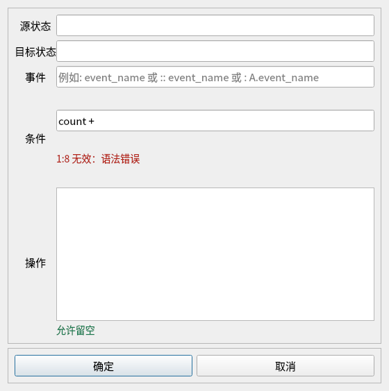 | 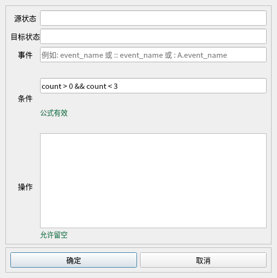 |
| effect | 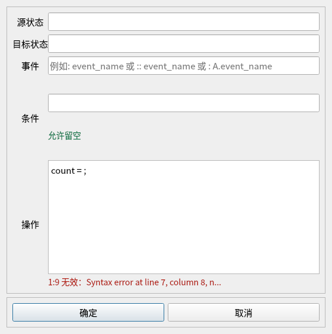 | 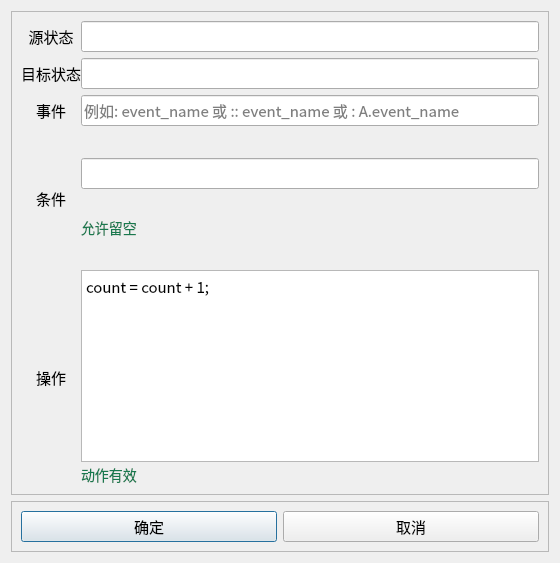 |
| lifecycle | 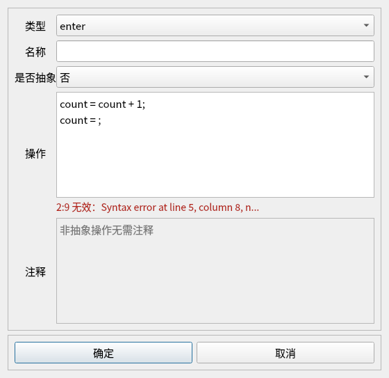 | 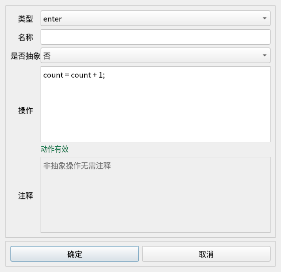 |
| numeric | 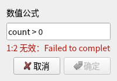 | 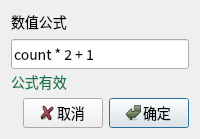 |

### 3.1 复合状态重命名

1. 用 GUI 打开第 1.4 节 `rename-crlf.fcstm`，先记录原始 bytes SHA-256 和换行计数。
2. 分别从原始副本执行：`Leaf -> LeafRenamed`（simple）、`Parent -> Renamed`（composite）、`Parent -> UnicodeBoundaryRenamed`（unicode-crlf；“Unicode”指前置 emoji/中文注释跨越 Qt UTF-16 offset，不是非法的 Unicode 标识符）。
3. 在提交预览中确认 TextEdit 只覆盖 name token。
4. undo、redo、保存并重开。
5. 对比修改前后字节：除名称 token 与明确引用外必须逐字一致。

自动化 item：第 6 节展开的 21 个 model ID，以及 `rename.simple`、`rename.composite`、`rename.unicode-crlf`、`source.edit`、`source.save`、`source.fresh-reload`、`source.undo`、`source.redo`。

### 3.2 imported/generated 只读来源

1. 确认 `root-import.fcstm`、`child.fcstm`、`leaf.fcstm` 位于同一目录，用 GUI 打开根文件。
2. 在模型树选择 `Root.Imported`，再选择 `Root.Imported.Nested`；若事件表有生成 projection，也逐项选择。
3. 确认编辑、删除不可用，并在控件附近显示只读原因。
4. 按“打开来源”，确认只读源码页、canonical URI 和准确范围。
5. 返回根文档，原选择和 revision 保持。

自动化 item：`imported.readonly`、`imported.open-source`。

### 3.3 四类公式

使用 `crud.fcstm` 中已声明的 `count`，按下表输入：

| ID | valid | invalid | 预期 |
| --- | --- | --- | --- |
| `formula.guard.valid` / `formula.guard.invalid` | `count > 0 && count < 3` | `count +` | valid 可提交；invalid 有行列/offset 且阻止提交 |
| `formula.numeric.valid` / `formula.numeric.invalid` | `count * 2 + 1` | `count > 0` | numeric grammar 独立，不能接受 logical |
| `formula.effect.valid` / `formula.effect.invalid` | `count = count + 1;` | `count = ;` | invalid 位置指向分号附近，整模提交被阻止 |
| `formula.lifecycle.valid` / `formula.lifecycle.invalid` | `count = count + 1;` | `count = count + 1;` 换行 `count = ;` | invalid 指向第 2 行 |

每类先输入 invalid，防抖结束前立即改成 valid；最终只允许最新 token/revision 显示“公式有效/动作有效”。随后再次输入 invalid，并在防抖期间向源码末尾输入一个空格制造新 revision；旧回调不得覆盖新字段状态，这一步单独记录 `formula.stale`。最后恢复并通过整模提交。每次记录字段 objectName、错误位置、reason、request token、最终 revision 和源码片段。

自动化 item：上表 8 个完整 ID、`formula.stale`，以及十二个 keyboard item 中的四个 formula item。

## 4. 文档替换、最近文件、取消与 stale

### 4.1 最近文件

1. 按第 1.4 节创建 `recent-01.fcstm` 至 `recent-12.fcstm`，依次用 GUI 打开，再次打开 `recent-06.fcstm`。
2. “文件 -> 最近文件”只保留 10 个、按最近排序、canonical 去重。
3. 默认只显示文件名，tooltip 使用脱敏路径；开启全局完整路径后才显示完整路径。
4. 删除磁盘上的最近文件并点击它；当前文档保持，该项从菜单移除并显示可见提示。
5. 执行“清空最近文件”，确认禁用占位“暂无最近文件”。

### 4.2 dirty Save/Discard/Cancel 三分支

每个分支先把 `acceptance.fcstm` 和 `other.fcstm` 恢复成第 1.4 节 bytes，并重新启动成品，避免前一分支污染下一分支。

1. 打开 `acceptance.fcstm`，在源码末尾输入 `// dirty-branch`，使状态区显示“未保存”；记录磁盘 SHA、session、selection、undo 和 workspace。
2. 用 GUI 打开 `other.fcstm`，分别选择 Save、Discard、Cancel。
3. Save：当前文件精确写盘后加载目标；保存失败则回到确认框。
4. Discard：不写盘，加载目标。
5. Cancel：当前 session、dirty、selection、undo、workspace 全部保持。

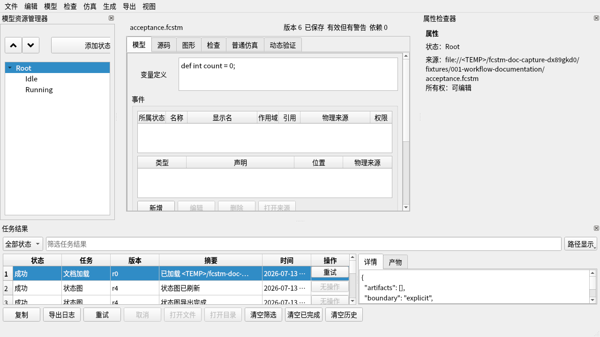

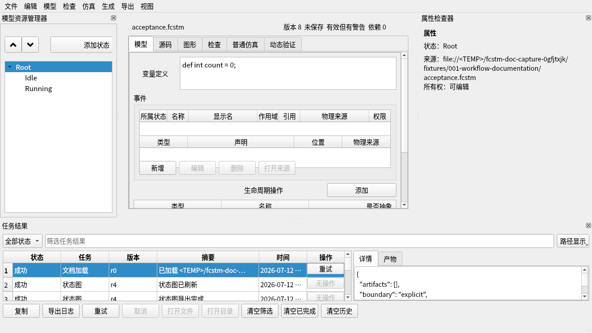

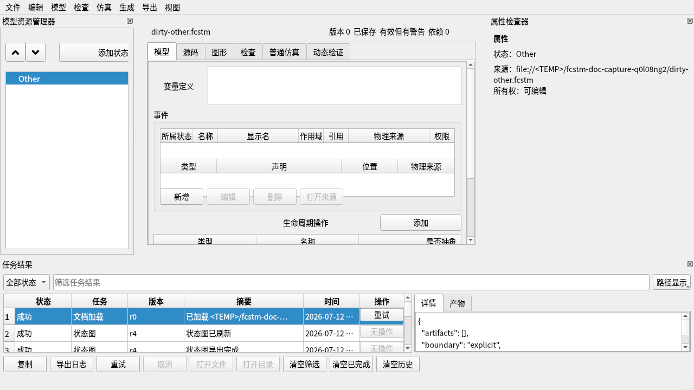

### 4.3 六类取消

每项都从 clean fixture 开始；按下启动按钮后，必须等“停止”启用再立即按下。若任务已完成、停止从未启用，该次不算取消证据，重新运行；不得通过 monkeypatch/睡眠修改产品。

| ID | 确定触发 | 取消 oracle |
| --- | --- | --- |
| `cancel.load` | 使用隔离的确定性 `large.fcstm`（20,000 行注释 + 同一合法模型），任务中心出现 running 加载行后立即按该行“取消” | 原 session/dirty/selection/undo/workspace 全保持 |
| `cancel.simulation` | cycle 上限 `10000` 连续运行 | cycle 边界取消；已完成 transcript 保留；状态非 success/failed |
| `cancel.dynamic` | “全部验收”后立即停止 | 已完成 step 保留；普通仿真 runtime 不变 |
| `cancel.graph` | 刷新后立即停止 | 上一张有效图保留；不得发布诊断/半图 |
| `cancel.generation` | 使用隔离 custom template 目录（确定性生成 300 个小模板文件）后启动生成，running 行出现即停止 | staging 清理；旧目标 inventory/SHA 不变 |
| `cancel.export` | 使用固定图形 fixture 和确定性 PNG/PDF 目标，running 行出现即停止 | 临时文件清理；旧目标 bytes/SHA 不变 |

所有结果记录取消边界、完成数量、临时目录 inventory、旧目标 SHA 和 TaskStatus=`cancelled`。任务过快导致三次均无法命中取消窗口，应记录产品可测性失败，不能把普通完成算作通过。

人工点击受机器调度影响时，直接执行发布包内置的确定性取消/stale 验收；它会生成足够大的隔离 fixture，并在控件启用后立即点击，不需要修改源码或安装 Python：

```bash
./fcstm-gui --acceptance-check --viewport 1280x720 \
  --json-report acceptance-output/report.json \
  --artifact-dir acceptance-output/artifacts
```

onedir 用户先 `cd fcstm-gui` 再执行上式；onefile 用户在二进制所在目录直接执行。Windows PowerShell 对 onedir 同样先进入 `fcstm-gui` 目录，再把命令开头改为 `.\fcstm-gui.exe`。命令必须最终显示 `140 passed / 0 failed`；在 `report.json` 中逐项确认六个 `cancel.*` 为 passed、`evidence.status=cancelled`，且各项 `artifact_inventory` 非空。普通完成不得替代取消结果。

### 4.4 五类 stale

对 `stale.graph`、`stale.simulation`、`stale.dynamic`：启动任务，确认 busy/停止已启用，立即切到源码末尾输入一个空格并等待 revision 增加；仿真在 cycle 边界、动态验证在 step 边界、图形在发布前检查 stale。

`stale.generation`、`stale.export` 当前由发布包内置 acceptance harness 以 **modeless
确定路径** 验证：harness 打开生成/导出对话框后，在任务仍运行时对隔离 fixture
追加源码变更，重新计算 dependency fingerprint，再断言旧结果被拒绝。普通菜单中的
生成/导出对话框是 modal，不能把“同时点击被 modal 阻塞的源码页”当作普通用户手工
路径；若要手工复现，应先用外部编辑器修改 harness 指定的 `leaf.fcstm`，然后重新
从 GUI 提交任务，而不是声称当前产品有文件 watcher 自动触发 stale。

统一 oracle：TaskStatus=`stale`，结果保存旧 revision/fingerprint 供查看，但当前图、runtime/report、生成目录或导出目标不得被旧结果覆盖。随后 undo 源码空格，或把 `leaf.fcstm` 恢复成原 bytes，再重跑并确认成功绑定新 revision/fingerprint。每项记录 before/after revision、fingerprint、目标 SHA 和 task id。

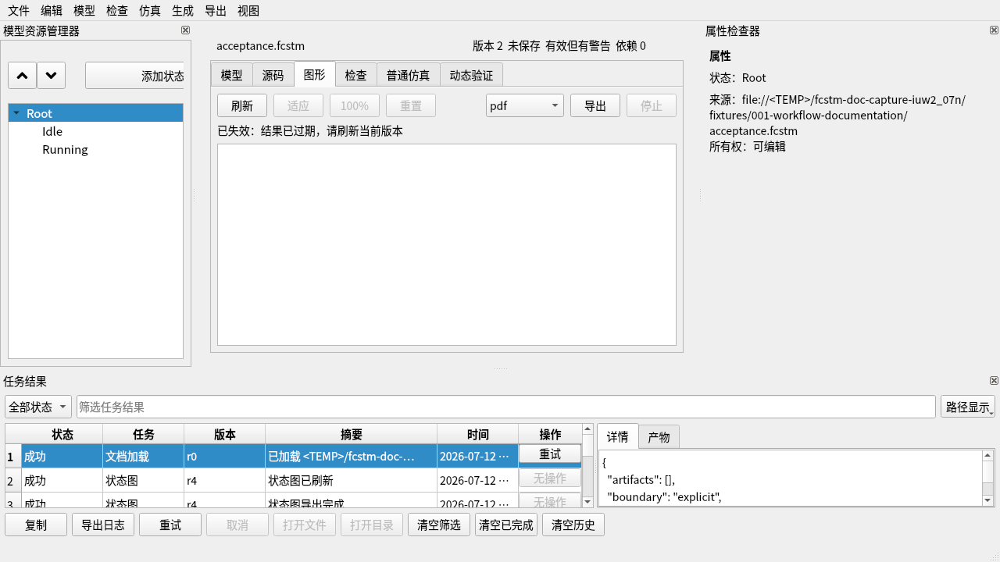

同一份内置 acceptance 报告还必须包含五个 `stale.*` passed 项；逐项核对旧 revision/fingerprint、`status=stale` 和未发布旧产物的 evidence。这样人工调度速度不会成为 stale 证明的前提。

自动化 item：`document.recent-reopen`、`dirty.save`、`dirty.discard`、`dirty.cancel`，以及第 6 节展开的六个 cancel 和五个 stale ID。

## 5. 键盘、几何与可达性

### 5.1 十二个稳定键盘 item

每项从规定起始焦点执行，只发送快捷键、Tab、方向键、Enter/Space 和文本输入；文件对话框使用 Qt 非原生测试模式，不 monkeypatch 返回值。

| item | 起始焦点 | 确定按键序列 | 最终事实 |
| --- | --- | --- | --- |
| `keyboard.model` | `AppMainWindow` | `Ctrl/Cmd+1` -> Tab/方向键选择 `Root` -> Enter 打开编辑 -> Tab 到 name -> 输入 -> Tab 到提交 -> Enter | revision 增加、树与 source 同步 |
| `keyboard.inspect` | `AppMainWindow` | F5 -> `Ctrl/Cmd+4` -> Tab 到筛选/列表 -> 方向键选首项 -> Tab 到定位 -> Enter | source cursor 为同一 URI/revision 的非空 span |
| `keyboard.generation` | `AppMainWindow` | `Ctrl/Cmd+Shift+G` -> Tab/方向键选 Python -> Tab 到输出目录 -> 输入 -> Tab 到开始 -> Enter | `generation.python` 成功且 inventory 非空 |
| `keyboard.templates` | `generation_template_combo` | Home -> 方向键依次经过 `python,c,c_poll,cpp,cpp_poll`，每项 Space/Enter | 五个稳定 template ID 均记录，不能只记录文案 |
| `keyboard.graph` | `AppMainWindow` | `Ctrl/Cmd+3` -> Tab 到刷新 -> Space -> Tab 到适应/100%/重置并逐项 Space | Smetana 图 ready，所有按钮焦点可见 |
| `keyboard.simulation` | `AppMainWindow` | `Ctrl/Cmd+5` -> Tab 输入 `{}`/`Start` -> 初始化 -> 单步 -> 输入 `10000` -> 连续 -> 暂停 -> 输入 `2` -> 继续 | 同一 runtime，paused segment 和连续 transcript 可见 |
| `keyboard.syntax` | `source_editor` | `Ctrl/Cmd+2` -> 输入空格 -> `Ctrl/Cmd+Z` -> `Ctrl/Cmd+Shift+Z` -> `Ctrl/Cmd+S` | source/revision/dirty/磁盘 SHA 一致 |
| `keyboard.workspace` | `AppMainWindow` | `Ctrl/Cmd+1` 至 `Ctrl/Cmd+6` 逐一发送 | 六页依次 current/visible，焦点落在首要 objectName |
| `keyboard.formula.guard` | guard field | 输入 invalid -> 等防抖 -> `Ctrl/Cmd+A` -> 输入 valid -> Tab 到提交 -> Enter | logical 反馈和提交门禁匹配 |
| `keyboard.formula.effect` | effect field | 输入 invalid -> 等防抖 -> `Ctrl/Cmd+A` -> 输入 valid -> Tab 到提交 -> Enter | effect 反馈和整模门禁匹配 |
| `keyboard.formula.lifecycle` | lifecycle action field | 输入两行 invalid -> 等防抖 -> `Ctrl/Cmd+A` -> 输入 valid -> Tab/Enter | 第 2 行错误消失，整模提交通过 |
| `keyboard.formula.numeric` | `numeric_formula_input` | 输入 `count > 0` -> 等防抖 -> `Ctrl/Cmd+A` -> 输入 `count * 2 + 1` -> Tab/Enter | invalid 阻止、valid 接受且值写入 |

每个 item 使用如下记录模板；每个按键一步一行，禁止只填最终结果：

| item | step | key_sequence | focus_before | focus_after | visible/current | business_fact | screenshot/artifact | verdict |
| --- | ---: | --- | --- | --- | --- | --- | --- | --- |
| 待填 | 1 | 待填 | 待填 objectName | 待填 objectName | true/false | 待填 | 待填 SHA/path | PASS/FAIL |

文件选择器固定使用 Qt 非原生模式：先导航或设置到目标 `parent directory`，在 filename edit 输入 `basename`，等待 Open/Save `AcceptRole` 启用，再用真实按钮或标准确认键提交；不得 monkeypatch 返回值，也不得依赖“绝对路径直接 Enter”的平台差异。`graph.drag` 是唯一鼠标专属 item，另记录真实 wheel/press/move/release 前后的 transform/scroll 值。

### 5.2 几何/可达性矩阵

三平台、onedir/onefile 两种成品分别执行 1280x720、1920x1080 与 scale 1、1.5、2 的交叉组合，共 36 个成品配置。每个配置遍历六个激活工作区；只检查 `isVisibleTo(window)` 的控件，把 rect 映射到 window 后要求 content rect 完全 contains，而不是仅 intersects。

每个配置必须生成一份报告，逐 workspace 填写：

| platform | artifact | viewport | scale | workspace | contained | unknown overlap | scrollbar | header/current value | focus chain | font | accessible names | screenshot SHA | verdict |
| --- | --- | --- | --- | --- | --- | --- | --- | --- | --- | --- | --- | --- | --- |
| 待填 | onedir/onefile | 待填 | 待填 | model/source/graph/inspect/simulation/dynamic | true/false | 数量与控件对 | policy/visible | visible/clipped | objectName 列表 | family/pt | 缺失列表 | 待填 | PASS/FAIL |

结构性 overlap 豁免仅限 splitter handle、dock title bar、tab bar/page frame、scroll viewport/scrollbar、combo popup、tooltip、modal overlay。Cocoa 原生按钮 geometry 接触只允许 acceptance 中精确预批准的 `ordinary_simulation_panel` 与 `dynamic_validation_panel` 控件对；每条必须记录 platform/qt platform/style/layout/viewport/scale、控件对、交集、截图路径/SHA 和稳定 join key，并要求 `text_visible`、`hit_test_passed`、`click_passed`、`focus_passed`、`accessible_name_passed`、`business_fact_passed`、`artifact_fact_passed` 全为 true。像素数只记录事实，不是放行阈值；未知交集不得自动忽略。任一文本裁切、当前值不可见、误触、焦点丢失、缺 accessible name、业务或产物错误均使该配置失败。

### 5.3 人工像素检查

逐项结果图可从 [140 项 GUI Acceptance 截图索引](images/acceptance-140/README.md) 按稳定
ID 打开；每张图必须与 manifest 中的 SHA、viewport 和报告结果一致。人工检查只记录
真实功能事实：文字/数据可读、中心命中、点击、焦点、accessible name、业务状态和产物
事实。轻微原生边框接触只要不妨碍使用就记为 non-blocking，不得改写为功能通过。

逐张确认中文无方框、控件无裁切或重叠、状态不只靠颜色、失败原因与恢复动作可见、图形不是 renderer 诊断图、路径默认脱敏。机械 geometry 通过不能替代人工检查。

最终人工证明固定为 54 张 fresh geometry 图：Linux/Windows/macOS × onedir/onefile 六个组合，每组合 9 张。逐图记录 platform、Qt platform、layout、GitHub artifact 名、product 路径/SHA、acceptance report 路径/SHA、截图路径/SHA、viewport、scale、稳定 join key 和七项功能 verdict。`docs/visual-review.schema.json` 禁止额外字段，`scripts/verify_evidence_contract.py --visual-review <JSON> --visual-root <下载根目录>` 必须通过；每个 Cocoa overlap exemption 必须与同 SHA 截图中的 attestation item 一一对账，不能漏审或复用。

阻塞只按功能事实判定：文字/数据裁切、中心命中错误或误触、键盘焦点不可达、accessible name/tooltip 缺失、业务状态错误、文件/JSON/SHA/产物错误均 blocking。原生 style 外框、focus ring、边界接触或留白差异在上述事实全部正确时记入 `non_blocking_findings`，不得仅因接触像素数阻塞使用和发布。

## 6. Acceptance-family 覆盖矩阵

状态含义：`参考图` 表示本文已有源码态图片；`自动化` 表示最终 acceptance 必须产生独立 item；`fresh` 表示最终三平台成品证据。任一行缺少章节、自动化或最终证据时不得标记 READY。

| family | 操作章节 | 当前参考图 | 最终稳定 item/evidence |
| --- | --- | --- | --- |
| 文档打开/最近/失败保持 | 2.1、4.1 | 打开流程 | `document.open`、`document.recent-reopen`、`document.cancel-load`、`document.failed-load-preserves-session` |
| dirty 三分支 | 4.2 | 三分支 source 图已有 | `dirty.save`、`dirty.discard`、`dirty.cancel` |
| 源码编辑/保存/重载 | 3、5.1 | 诊断前后源码 | `source.edit`、`source.undo`、`source.redo`、`source.save`、`source.fresh-reload` |
| 七类模型表单 CRUD | 3 | 140 项逐项图廊（含 21 个 model item） | `model.state.add`、`model.state.edit`、`model.state.delete`、`model.variable.add`、`model.variable.edit`、`model.variable.delete`、`model.event.add`、`model.event.edit`、`model.event.delete`、`model.transition.add`、`model.transition.edit`、`model.transition.delete`、`model.guard.add`、`model.guard.edit`、`model.guard.delete`、`model.effect.add`、`model.effect.edit`、`model.effect.delete`、`model.lifecycle.add`、`model.lifecycle.edit`、`model.lifecycle.delete` |
| imported/generated | 3.2 | 140 项逐项图廊 | `imported.readonly`、`imported.open-source` |
| 简单/复合/Unicode 重命名 | 3.1 | 140 项逐项图廊（含预览结果） | `rename.simple`、`rename.composite`、`rename.unicode-crlf` |
| 三来源诊断与修复 | 2.2 | 分阶段参考图 + 140 项逐项图廊 | `diagnostics.syntax`、`diagnostics.assembly`、`diagnostics.inspect`、`diagnostics.filter-search`、`diagnostics.conflict-warning`、`diagnostics.locate`、`diagnostics.suggested-fix` |
| 四类公式 | 3.3、5.1 | 8 张 valid/invalid source 图已有 | `formula.guard.valid`、`formula.guard.invalid`、`formula.numeric.valid`、`formula.numeric.invalid`、`formula.effect.valid`、`formula.effect.invalid`、`formula.lifecycle.valid`、`formula.lifecycle.invalid`、`formula.stale` |
| 图形交互 | 2.3 | 分阶段参考图 + 140 项逐项图廊 | `graph.refresh`、`graph.zoom`、`graph.drag`、`graph.fit`、`graph.reset`、`graph.selection` |
| 四类图形导出 | 2.3 | 图形参考图 + 140 项逐项图廊；三平台文件证据待 final | `graph.export.plantuml`、`graph.export.png`、`graph.export.svg`、`graph.export.pdf` |
| 普通仿真 | 2.4 | 初始化/单步/暂停/继续有 | `simulation.initialize`、`simulation.step`、`simulation.run`、`simulation.pause`、`simulation.continue`、`simulation.reset`、`simulation.stop` |
| 动态验证 | 2.5 | 分阶段参考图 + 140 项逐项图廊 | `dynamic.case.design_evented_pseudo_chain_invalid_then_valid`、`dynamic.case.design_validation_failure_multilevel_transition`、`dynamic.case.expression_failure_transition_guard_raises_expression_error`、`dynamic.case.pseudo_self_loop_step_limit_raises_dfs_error`、`dynamic.user`、`dynamic.mutation`、`dynamic.recover`、`dynamic.export` |
| 术语边界 | 2.5 | 140 项逐项图廊 | `terminology.dynamic-not-formal` |
| 五内置+自定义生成 | 2.6 | 分阶段参考图 + 140 项逐项图廊 | `generation.python`、`generation.c`、`generation.c-poll`、`generation.cpp`、`generation.cpp-poll`、`generation.custom`、`generation.overwrite` |
| 九类统一导出 | 2.7 | 分阶段参考图 + 140 项逐项图廊；三平台文件证据待 final | `export.dsl`、`export.word`、`export.excel`、`export.plantuml`、`export.png`、`export.svg`、`export.pdf`、`export.inspect-json`、`export.dynamic-json`、`export.overwrite-preserves-target` |
| 任务中心 | 2.8 | 分阶段参考图 + 140 项逐项图廊 | `tasks.filter`、`tasks.copy`、`tasks.export`、`tasks.clear-filtered`、`tasks.clear-completed`、`tasks.clear-all`、`tasks.retry`、`tasks.cancel`、`tasks.artifact`、`tasks.redaction` |
| 显式/瞬时任务注册 | 2.8 | 历史有 | `tasks.registry.load`、`tasks.registry.inspect`、`tasks.registry.graph`、`tasks.registry.simulation`、`tasks.registry.dynamic`、`tasks.registry.generation`、`tasks.registry.export`、`tasks.transient.document-validation`、`tasks.transient.formula-validation` |
| 五类 stale | 4.4 | 140 项逐项图廊；fresh 运行边界待 final | `stale.graph`、`stale.simulation`、`stale.dynamic`、`stale.generation`、`stale.export` |
| 六类取消 | 4.3 | 140 项逐项图廊；fresh 运行边界待 final | `cancel.load`、`cancel.simulation`、`cancel.dynamic`、`cancel.graph`、`cancel.generation`、`cancel.export` |
| 十二键盘 item | 5.1 | 核心结果图 | `keyboard.model`、`keyboard.inspect`、`keyboard.generation`、`keyboard.templates`、`keyboard.graph`、`keyboard.simulation`、`keyboard.syntax`、`keyboard.workspace`、`keyboard.formula.guard`、`keyboard.formula.effect`、`keyboard.formula.lifecycle`、`keyboard.formula.numeric` |
| 几何 | 5.2 | 1280x720 source 图 | `geometry.active-workspaces`；36 个 `geometry-<platform>-<artifact>-<viewport>-<scale>.json`，每份含六 workspace 独立 verdict |
| 可达性 | 5.2 | 字体可见 | 同一 36 报告中的 font、accessible name、focus order、CJK glyph 字段 |
| 视觉 | 5.3、8 | 67 张 source 图 | `visual.linux`、`visual.windows`、`visual.macos` 和 54 项 strict final Issue visual attestation |

## 7. 盲操作复现检查表

由未参与实现的操作者在不阅读源码、不调用 service、不修改 fixture 期望值的条件下执行。每项填写实际观察和证据路径。

| 检查 | 通过标准 | 结果/证据 |
| --- | --- | --- |
| 从空首屏打开模型 | 只依赖菜单/快捷键，模型事实正确 | 待每轮填写 |
| 制造错误并恢复 | 能从诊断定位，不依赖日志猜位置 | 待每轮填写 |
| 识别真实状态图 | 能指出 Root/Idle/Running/Start，画面无 Graphviz 文本 | 待每轮填写 |
| 完成一次仿真 | 能初始化、输入 Start、看到 count=1 | 待每轮填写 |
| 完成动态 suite | 能解释 expected/actual，知道它不是形式化验证 | 待每轮填写 |
| 生成五模板 | 能从 GUI 找到全部模板和 SHA 清单 | 待每轮填写 |
| 导出九格式 | 能选择目标、识别覆盖策略、找到产物 | 待每轮填写 |
| 查找失败任务 | 能筛选、读取原因、重试且无默认路径泄露 | 待每轮填写 |
| dirty/最近文件 | 能预测 Save/Discard/Cancel 后果并恢复 | 待每轮填写 |
| 七类 CRUD 与 fresh reload | 21 个 ID 均由真实表单完成并重开一致 | 待每轮填写 |
| imported/rename/四公式 | 只读来源、精确 token、8 valid/invalid 与 stale 均可复现 | 待每轮填写 |
| 六取消/五 stale | 每项命中真实协作边界且旧结果未发布 | 待每轮填写 |
| 自定义模板 | 最小模板生成 `root=Root`，缺 config 原子失败 | 待每轮填写 |
| 任务清空语义 | 清空筛选不影响其他状态；清空已完成只删 success；清空历史不删除 running | 待每轮填写 |
| geometry/a11y | 36 配置报告完整，未知 overlap/缺 accessible name 为零 | 待每轮填写 |
| 仅键盘完成核心路径 | 焦点始终可见，无鼠标救援 | 待每轮填写 |

盲操作中任何一步需要维护者口头解释、使用隐藏快捷方式、直接调用 Python 或跳过失败分支，均记录为未通过。

## 8. 每轮截图与文档审阅记录

`source-reference-1` 是截图维护者的像素复核，不是
`docs/plans/gui-productization.md §13.1` 的独立盲操作。独立 reviewer 必须逐项填写
下表；不得预填 PASS，不得让实现作者代签。

| round | reviewer | date UTC | commit/run | environment | covered item IDs | failed step/observation | documentation/product modification | evidence path/SHA | verdict |
| --- | --- | --- | --- | --- | --- | --- | --- | --- | --- |
| source-reference-1（非独立盲跑） | Codex root visual review | 2026-07-12 | 见 manifest source identity | Linux xcb, 1280x720, scale 1, source | manifest 中 53 个 acceptance ID/67 图 | model CRUD 仅有 add action；cancel/stale 未覆盖全矩阵；非 fresh | 修正公式按钮和自定义模板说明后重抓；逐图 SHA/尺寸/非空检查通过 | `docs/images/workflows/manifest.json` | PASS-SOURCE-REFERENCE-ONLY |
| blind-review-1 | OMX verifier (`m4_dynamic_service`) | 2026-07-12 | 当前 M7 工作树 | Linux source；文档测试为 offscreen | 当时第 6 节 139 个显式 ID | 缺扩展截图、三平台 fresh、第二轮盲跑；审阅表分隔列数错误 | 修正审阅表；其余缺口继续由 acceptance/CI 补齐 | `docs/reviews/2026-07-12-blind-review-1.md` | C=2 / I=3 / M=1 / NOT READY |
| blind-review-2 | OMX verifier (`m4_dynamic_service`) | 2026-07-12 | 当前 M7 工作树 | Linux source；文档测试为 offscreen；PNG 抽检 | 67 图/53 ID 及第 6 节全矩阵 | 完整矩阵、36 geometry/a11y、三平台 fresh 尚缺；manifest 为 dirty source | 67 图 SHA/magic/尺寸通过；补路径显示边界 | `docs/reviews/2026-07-12-blind-review-2.md` | C=2 / I=3 / M=1 / NOT READY |
| blind-review-3 | OMX verifier (`ux_prototype_review`) | 2026-07-12 | 当前最终候选 | Linux xcb source；140 项合同与 67 图 | 140/140 ID、确定 fixture/oracle、图解主流程 | 仅剩 push 后 fresh 外部证据 | 三轮修订后 source-ready C/I 清零 | `docs/reviews/2026-07-12-blind-review-3.md` | C=0 / I=0 / SOURCE-READY |
| fast-verify-previous | Codex root | 2026-07-13 | `main@9316b62` / run `29224357557` | Linux/Windows native source | Linux 182/182 + 140/140；Windows 165/182 | Windows Cairo DLL 未继承 MINGW PATH；本轮修复改为两阶段 build/fresh，待新 run | 记录为失败根因，不得当作通过证据 | [run 29224357557](https://github.com/zhougut/fcstm-gui/actions/runs/29224357557) | WINDOWS-REVERIFY |
| fast-verify-current | Codex root | 2026-07-13 | `main@eaf101e` / run `29227721434` | Linux/Windows native source + fresh onefile | Stage 1 两个平台均 `182/182 self-check` + `140/140 GUI acceptance`；Stage 2 两个平台均 fresh `182/182 self-check` | 无失败；Windows Cairo PATH、MinGW/Python 边界、UTF-8 evidence 读取和 workflow path filter 均通过 | 两阶段 Fast Verify、四份 evidence 与两份 onefile product 均上传；每个 job 10 分钟上限 | [run 29227721434](https://github.com/zhougut/fcstm-gui/actions/runs/29227721434) | PASS-FAST-GATE |
| full-release-baseline | Codex root | 2026-07-13 | `b6bb7e2` / run `29216171779` | Linux/Windows/macOS onedir+onefile fresh | 6 products × 6 viewport/scale reports | 182/182、140/140 | 六份 evidence verifier 已通过 | [run 29216171779](https://github.com/zhougut/fcstm-gui/actions/runs/29216171779) | PASS-BASELINE |
| final-visual-review | Codex root visual review | 2026-07-13 | `b6bb7e2` / run `29216171779` | Linux/Windows/macOS onedir+onefile | 54 张代表图、七项功能 verdict | 无 blocking；Cocoa 两类 boundary-contact non-blocking | `/tmp/fcstm-gui-visual-root/visual-review.json`，待 Issue 回填 | 同 SHA product/report/image 交叉校验 | PASS-PENDING-ISSUE |
| acceptance-gallery-140 | Codex root GUI replay | 2026-07-13 | 当前 `main`；见 `images/acceptance-140/manifest.json` | Linux xcb source，1280x720，scale 1，Python 3.7 | 140/140 独立 acceptance 截图、详情、SHA | 代表图与逐项图均人工抽检；无功能 blocking；不包含三平台 fresh | `docs/images/acceptance-140/README.md` + `manifest.json` | SOURCE-ACCEPTANCE-PASSED |

每次界面、文案、字体、viewport、fixture 或 acceptance item 变化后，都必须重跑截图脚本、复算 SHA、更新本表和第 6 节矩阵。只更新代码而不更新过期图片视为验收失败。

## 9. 当前缺口与 READY 门禁

当前源码参考图有 11 个流程目录、67 张分阶段真实步骤图，并新增 140 张稳定
acceptance ID 的逐项实操截图、详情、revision/fingerprint 和 SHA。逐项图廊证明
源码态 GUI 每项确实执行过，但仍不等价于 Full Release 的三平台 fresh artifact；旧的
source-reference 审阅记录继续保留为历史审计，不影响自动化合同。

两阶段 Fast Verify 已在 `29225796390` 完成，确认 Windows/Linux source 与 fresh
onefile self-check；Fast Verify 状态已回填 Issue #2/#3，源码态 140 项图廊也已入库。
历史 baseline 与 54-sample 视觉审阅仍按独立证据边界保留，并在需要发布新二进制时手动运行 Full Release。任何真正的文字裁切、
误触、不可达焦点、缺 accessible name、业务或 artifact 错误仍立即恢复为 blocking；
原生边框/边界接触且七项功能事实全真则继续 non-blocking。
